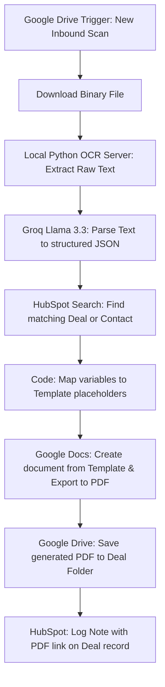

# W3 — Document Generator & OCR Parser (Implementation Plan)

This document outlines the architecture, OCR strategy, and step-by-step plan to build the new document generation and OCR ingestion pipeline using **100% free transaction-cost** tools.

---

## 1. Free OCR & Parser Architecture

To avoid ongoing API costs (like Claude Vision or paid OCR APIs), we will build a hybrid extraction pipeline using **local open-source tools** and **Groq Llama 3.3 (which is completely free)**.

### The Ingestion Pipeline:
1. **Local Text Extraction (Free):** If the file is a digital PDF, we extract its text electronically using a Python script with `pdfplumber`. This yields 100% accuracy with zero processing cost.
2. **Local Image OCR (Free):** If the file is a photo or a scanned/image-only PDF, we process it locally on your VPS using **Tesseract OCR (`pytesseract`)**. 
3. **Structured AI Parsing (Free):** Once the raw, messy text is extracted locally, we send it to **Llama 3.3 (70B) via Groq's Free API** to clean the text and structure it into a precise JSON schema (containing the VIN, technical specs, mileage, and owner details).

### Why this approach?
* **€0 Transaction Cost:** Free local extraction + free Groq API calls.
* **Security:** Sensitive registration papers are processed locally on your server.
* **Accuracy:** Llama 3.3 (70B) excels at organizing messy OCR text into clean key-value structures.

---

## 2. Document Generation Strategy

To pre-fill Brokerage Contracts, Handover Protocols, Test Drive Agreements, and Sales Contracts:
1. **Google Docs Templates:** You will create templates in Google Docs containing double-brace placeholders (e.g., `{{vin}}`, `{{mileage}}`, `{{client_name}}`).
2. **n8n Google Docs Node:** n8n will duplicate the template doc, replace all placeholders with the parsed JSON data, and export it as a clean PDF.
3. **HubSpot Association:** The generated PDF will be saved to Google Drive and pinned to the HubSpot Deal timeline.

---

## 3. New W3 Workflow Architecture

The new workflow will follow this sequence:

---

## 4. IMAP/SMTP Integration Details

Since you use **Strato custom domain email** (`info@car-agents.de`) accessed via IMAP/SMTP, we will configure the email nodes as follows:

* **Trigger (W1 - Email Logger):** Replaced `Gmail Trigger` with the native **IMAP Email Trigger** node.
* **Sender (W5 - Daily Briefing):** Replaced `Gmail Send` with the native **Send Email (SMTP)** node.
* **Credentials needed:** Strato IMAP/SMTP host, port, username, and password.

---

## 5. Checklist: What to Request from the Client

Here is the exact list of requirements and files we need from the client to initiate setup:

### A. Document Templates & Samples (For W3 Document Generator)
1. **Blank Templates:** The Google Docs templates for the 4 core files:
   - Brokerage Contracts (Sales & Procurement)
   - Vehicle Handover Protocols
   - Test Drive Agreements
   - Sales Contracts
2. **Raw Scan Samples (3-5 examples of each):**
   - Vehicle Registration Part 1 & Part 2 (Fahrzeugschein / Fahrzeugbrief)
   - Sample maintenance invoices
   - Digital service records

### B. Technical Details & Credentials
3. **Strato Email Connection Info:**
   - IMAP Server & Port (e.g., `imap.strato.de`, port `993` SSL/TLS)
   - SMTP Server & Port (e.g., `smtp.strato.de`, port `465` SSL/TLS)
   - Username & Password for `info@car-agents.de`
4. **HubSpot Information (Fresh Setup):**
   - Official Business Name (for portal naming)
   - Timezone (Berlin/CEST confirmed)
   - List of team email addresses to invite as CRM users
5. **Briefing Recipient Number:**
   - The personal WhatsApp mobile number to receive the Daily & Weekly briefing alerts.
6. **Groq API Key:**
   - The API key for Groq (free tier) to power the Llama 3.3 document parser.
