# CAR-AGENTS — Client Scope Analysis & Gap Assessment Report

**Document Title:** Client Scope Audit & Implementation Status Report
**Based on:** `Beschreibung der Ist Situation und Soll Vorstellung.pdf` (Client Lastenheft)
**Cross-Referenced with:** `CAR-AGENTS_New_Scope_Requirements_Doc.md` & Active CARS AI Codebase
**Date:** August 11, 2026

---

## 1. Executive Summary

The client's scope document (*"Anforderungsprofil & Lastenheft: KI-gestütztes Backoffice-Betriebssystem für CAR-AGENTS"*) defines a vision for an automated, cloud-based backoffice solution designed to relieve the founder from manual daily operations and prepare the business for multi-tenant **Franchise-Readiness**.

Our audit compares the client's 4 core functional areas against what is **Completed**, **Partially Implemented**, and **Remaining/Out-of-Scope** in the current codebase.

### Overall Progress Overview:
* **Fully Implemented / Aligned**: ~**60%** (Dual Buy/Sell Pipelines, Net Profit Calculator, OCR Vehicle Document Parsing, 1-Click PDF Contract Pre-filling, Google Drive Folder Automation, Google Calendar Sync, Email AI Intent Classification).
* **Partially Implemented**: ~**25%** (WhatsApp Webhooks, Digital Signature Web Sessions, Lead Package Mapping, Automated FAQs).
* **Remaining / Out-of-Scope**: ~**15%** (PSD2 Bank API payment tracking, Kleinanzeigen/mobile.de direct multiposting bots, full DATEV export).

---

## 2. Detailed Functional Gap Analysis

```mermaid
graph TD
    A["Client Scope (Lastenheft PDF)"] --> B["3.1 Intelligent Request & Time Mgmt"]
    A --> C["3.2 Cloud Media & Listing Mgmt"]
    A --> D["3.3 Document & Legal Automation"]
    A --> E["3.4 Controlling, Cashflow & Bank API"]
    A --> F["4.0 Master-Agent Principle"]

    B --> B1["Dual Calendar Sync (Done)"]
    B --> B2["Lead Qualification Buy/Sell (Done)"]
    B --> B3["Service Package Tiering (Partial)"]

    C --> C1["Google Drive Cloud Media (Done)"]
    C --> C2["Drive Links in Inserat/WhatsApp (Partial)"]
    C --> C3["Kleinanzeigen/mobile.de Multiposting (Out of Scope / Manual API)"]

    D --> D1["OCR Fahrzeugschein & Forms (Done)"]
    D --> D2["1-Click PDF Contracts (Done)"]
    D --> D3["E-Signature Link §9 AGB (Partial)"]

    E --> E1["Net Margin & Profit Calculator (Done)"]
    E --> E2["PSD2 Bank API & Auto-Dunning (Remaining)"]

    F --> F1["Custom Founder Portal (Done)"]
    F --> F2["WhatsApp Master Agent Orchestration (Partial)"]
```

---

## 3. Matrix: Client Scope vs. Current Implementation

| Lastenheft Section | Feature / Requirement | Implementation Status | Implementation Details & Code Links | Scope Alignment & Status |
| :--- | :--- | :--- | :--- | :--- |
| **3.1 Intelligentes Anfragen- & Zeitmanagement** | **Zweiseitiger Kalender-Sync** (Sync main job & brokerage calendar with privacy masking) | **Fully Implemented** | Implemented via [google_service.py](file:///d:/CARS%20AI/backend/app/services/google_service.py), [meetings_sync.py](file:///d:/CARS%20AI/backend/app/api/v1/endpoints/meetings_sync.py), and [Calendar.jsx](file:///d:/CARS%20AI/frontend/src/pages/Calendar.jsx). Checks conflicts & syncs events. | **Aligned** (Google Calendar sync active; private title masking can be configured). |
| **3.1 Intelligentes Anfragen- & Zeitmanagement** | **Lead-Qualifizierung & Bot-Filter** (Auto-classify Buy/Sell intent & service packages: Essential, Advanced, Concierge) | **Partially Implemented** | Email & AI engine auto-classifies leads into `BUY_INTENT` vs `SELL_INTENT` via [claude_service.py](file:///d:/CARS%20AI/backend/app/services/claude_service.py) & [Leads.jsx](file:///d:/CARS%20AI/frontend/src/pages/Leads.jsx). | **Aligned** (Buy/Sell intent done; package tiering dropdown is pending). |
| **3.1 Intelligentes Anfragen- & Zeitmanagement** | **Autonome FAQ-Beantwortung** (AI answers vehicle questions based on inventory DB) | **Partially Implemented** | Backend email service generates automated replies in German/English ([email_service.py](file:///d:/CARS%20AI/backend/app/services/email_service.py)). | **Aligned** (Needs dynamic RAG inventory lookup). |
| **3.2 Cloudbasiertes Medien- & Inseratsmanagement** | **Zentralisierter Medien-Selbstservice** (Auto-upload photo/video to Google Drive folders) | **Fully Implemented** | Implemented via [gdrive_service.py](file:///d:/CARS%20AI/backend/app/services/gdrive_service.py). Creates vehicle folders and returns shareable URLs. | **Aligned** |
| **3.2 Cloudbasiertes Medien- & Inseratsmanagement** | **Linkbasierte Bereitstellung** (Embed Drive links in listing copy & WhatsApp replies) | **Partially Implemented** | Drive links generated automatically. WhatsApp integration ([whatsapp_service.py](file:///d:/CARS%20AI/backend/app/services/whatsapp_service.py)) supports outbound messages. | **Aligned** |
| **3.2 Cloudbasiertes Medien- & Inseratsmanagement** | **Automated Multiposting** (AI text generation via VIN & auto-drafting on Kleinanzeigen, mobile.de, AutoScout24) | **Out of Scope / Partial** | AI listing text generation via VIN is supported. Direct automated posting to Kleinanzeigen/mobile.de is restricted by platform anti-bot APIs. | **Requires Adjustment** (Recommend AI listing text generator + manual draft approval, avoiding bot bans). |
| **3.3 Dokumenten-Automatisierung** | **OCR-Erfassung & Variablen-Abfrage** (OCR Fahrzeugschein / ZB II, extract VIN, Erstzulassung, prompt missing parameters) | **Fully Implemented** | Implemented via [ocr.py](file:///d:/CARS%20AI/backend/app/api/v1/endpoints/ocr.py), [forms.py](file:///d:/CARS%20AI/backend/app/api/v1/endpoints/forms.py), [BuyForm.jsx](file:///d:/CARS%20AI/frontend/src/pages/BuyForm.jsx), [SellForm.jsx](file:///d:/CARS%20AI/frontend/src/pages/SellForm.jsx). | **Aligned** |
| **3.3 Dokumenten-Automatisierung** | **1-Click PDF Contract Pre-filling** (Vermittlungsvertrag B2C, Beschaffung, C2C Kaufvertrag) | **Fully Implemented** | Implemented in [pdf_service.py](file:///d:/CARS%20AI/backend/app/services/pdf_service.py) & [Contracts.jsx](file:///d:/CARS%20AI/frontend/src/pages/Contracts.jsx). Fills official templates (`{{vin}}`, `{{mileage}}`, etc.). | **Aligned** |
| **3.3 Dokumenten-Automatisierung** | **Linkbasierte E-Signatur** (Web links for digital signature compliant with §9 Abs. 2a AGB) | **Partially Implemented** | Web-based intake & contract review links exist ([forms.py](file:///d:/CARS%20AI/backend/app/api/v1/endpoints/forms.py)). Formal e-signature canvas (DocuSign/HelloSign or custom audit signature) needs final binding step. | **Aligned** |
| **3.4 Controlling & Cashflow** | **Unabhängiges Controlling-Dashboard** (Live net margin calculation per project: commission minus external costs) | **Fully Implemented** | Implemented via [calculator_service.py](file:///d:/CARS%20AI/backend/app/services/calculator_service.py), [ExpenseModal.jsx](file:///d:/CARS%20AI/frontend/src/components/ExpenseModal.jsx), and [Projects.jsx](file:///d:/CARS%20AI/frontend/src/pages/Projects.jsx). | **Aligned** |
| **3.4 Controlling & Cashflow** | **Bank-API & Automatisiertes Mahnwesen** (PSD2 bank account monitoring, setup fee verification, auto dunning) | **Remaining** | Open Banking PSD2 API (FinAPI/Tink) and automated dunning engine are not yet built. Currently manual payment tracking in CRM. | **Remaining Feature** (Requires PSD2 API credentials & dunning cron). |
| **4.0 Systembedienung** | **Das „Master-Agent“-Prinzip** (Single entry point via WhatsApp voice/text orchestrating backend systems) | **Partially Implemented** | Dedicated Founder Portal built ([App.jsx](file:///d:/CARS%20AI/frontend/src/App.jsx)). WhatsApp webhook ([webhooks.py](file:///d:/CARS%20AI/backend/app/api/v1/endpoints/webhooks.py)) and voice transcriber ([whisper_service.py](file:///d:/CARS%20AI/backend/app/services/whisper_service.py)) active. Full autonomous cross-system orchestration is in progress. | **Aligned** |

---

## 4. Key Recommendations & Action Plan

### 1. What We Have Delivered (Highlights)
1. **Founder Operations Portal**: Replaced manual administration with a custom web dashboard ([App.jsx](file:///d:/CARS%20AI/frontend/src/App.jsx)).
2. **Dual Buy vs. Sell Pipelines**: Distinct procurement and vehicle sales workflows ([Deals.jsx](file:///d:/CARS%20AI/frontend/src/pages/Deals.jsx)).
3. **Interactive OCR & PDF Contract Engine**: Automated scanning of vehicle documents and 1-click generation of German brokerage contracts ([pdf_service.py](file:///d:/CARS%20AI/backend/app/services/pdf_service.py)).
4. **Google Drive Cloud Integration**: Vehicle folder auto-creation and storage ([gdrive_service.py](file:///d:/CARS%20AI/backend/app/services/gdrive_service.py)).
5. **Net Broker Profit Calculator**: Itemized expenses + labor hours tracking (€20/h default) to give accurate net margins independent of DATEV.

### 2. Next Steps to Complete Remaining Client Scope
1. **Service Package Tiering**: Add explicit dropdown tags for `Essential`, `Advanced`, and `Concierge` packages in the Lead and Customer forms.
2. **Digital Signature Step**: Add a signature pad canvas component to [BuyForm.jsx](file:///d:/CARS%20AI/frontend/src/pages/BuyForm.jsx) and [SellForm.jsx](file:///d:/CARS%20AI/frontend/src/pages/SellForm.jsx) to satisfy §9 Abs. 2a AGB.
3. **PSD2 Bank API Integration**: Connect a lightweight Open Banking API (or webhook) to automate setup fee verification and overdue payment reminders.
4. **Multiposting Recommendation**: Clarify to the client that direct bot-posting to Kleinanzeigen/mobile.de risks IP/account bans. Recommend AI listing text generation with 1-click clipboard copy or official API exports.
